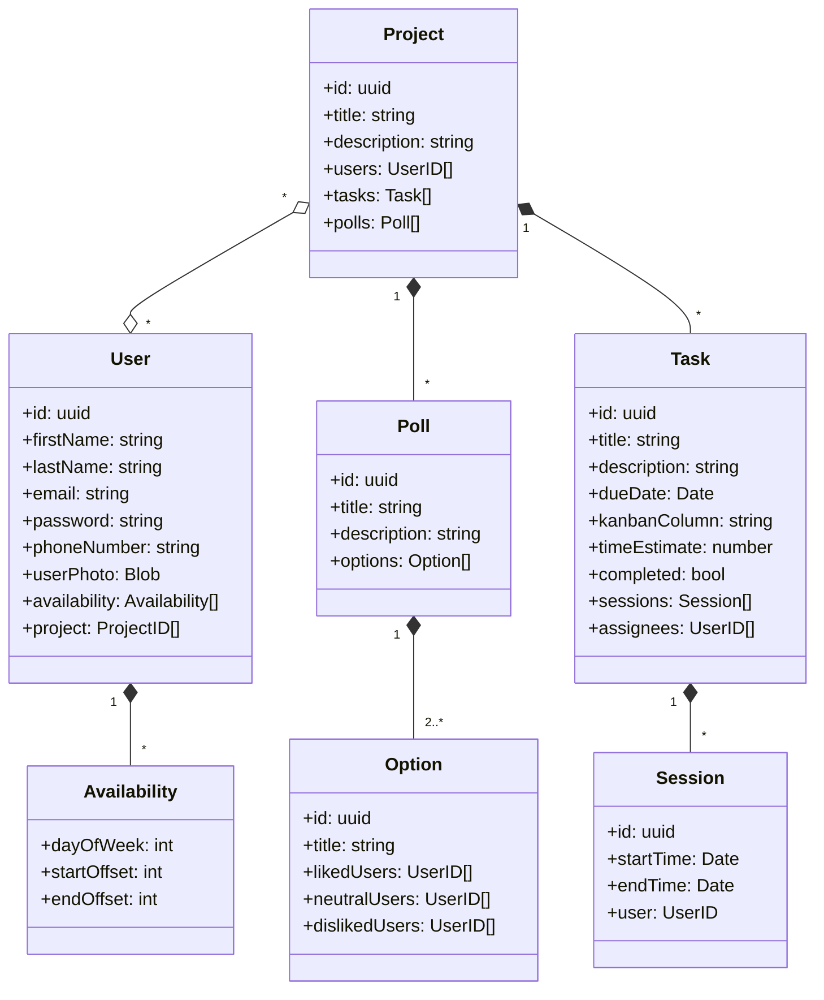
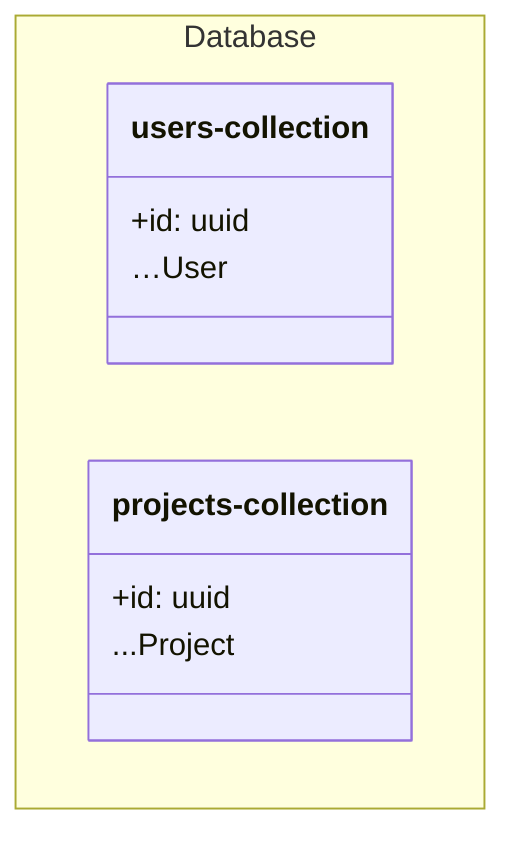
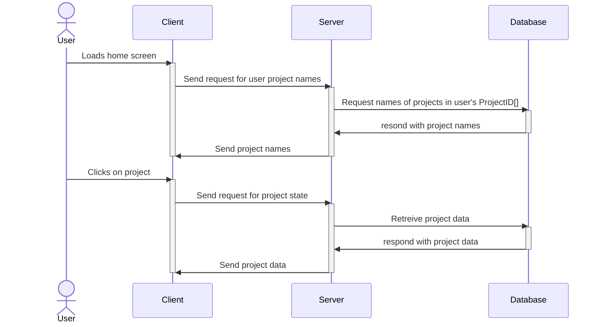
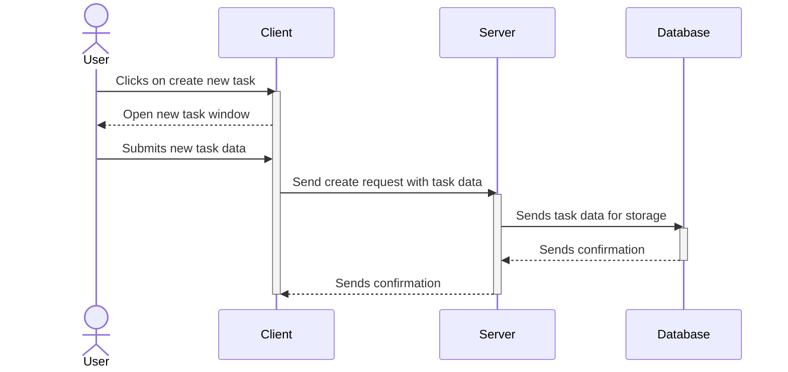
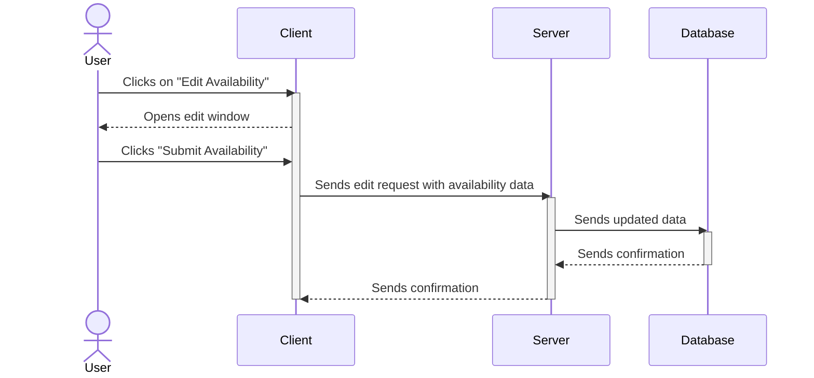

# Pleiades Design Document

### Team 5: Cate Harrison, John Kim, Henry Rovnyak, Ethan Dawes

## Purpose

Students at Purdue and similar universities are beset by the plight of bad group members, poor coordination, and bad time management. Although group work is critical to growing communication, collaboration, and leadership skills, this process is often frustrating. All students, from middle school through to university, could benefit from a tool that makes communication and collaboration easier in group activities. 

We believe that the core of good teamwork is clearly communicated assignments of responsibility and a strong sense of accountability in each team member for what they were assigned. These values help to prevent common moments like, “I thought you were doing X,” or, “I didn’t know we wanted Y done by today.” To foster these values, Pleiades is focused on tools to assign and review responsibility and accountability, so that all team members are on the same page.

There are many individual tools to help parts of teamwork, but these tools are scattered across multiple websites and sharing all of them with your teammates is tricky. Pleiades is a group work “toolbox” that provides tools such as finding open time slots in group members’ schedules, assigning roles and responsibilities, and tracking progress of group and individual tasks. Pleiades gives students a unified platform specifically designed for short term, small group collaboration.

#### Requirements

#### Functional

* As a user, I want to be able to
    * **Account**
        * Create an account with a email, real name, and password
        * Log in with a email and password so that I can see information for me and my team
        * (If time allows) login with social accounts (Google)
        * (If time allows) Reset my password so that I can recover my account
        * Upload a profile picture
    * **Group**
        * Create a group so that I can begin my project
        * Generate an invite link to the group so that I can collaborate with other students
        * (If time allows) Invite people directly in the app using their email
        * Click on invite links and automatically be added to that group
        * Be directed to the login page when clicking an invite link if not signed in and automatically being added to the group after signing in
        * Leave a group if I am leaving that group or changing group
        * Delete a group so that data can be deleted if wanted at the end of the project
        * See a list of groups I am in so that I can choose which group I want to view
        * View my teammates’ profiles, specifically names, profile pictures, and contact information
        * Create and view a group information panel with a project name, project description, and links in the description automatically converted to anchor tags
    * **Tasks**
        * View current tasks in a simplified 3 column kanban board
        * View who is assigned to each task
        * Create tasks so that I can track those tasks throughout the lifetime of the group project
        * Assign due dates to tasks
        * Assign time estimates to tasks
        * Delete tasks and mark tasks as completed
        * Assign/unassign tasks so that the entire team knows who is responsible for which tasks
        * Track time spent on tasks so that the team knows how much time has been spent by who on each task
        * (if time allows) View a personal window with all tasks I am assigned to across multiple groups
    * **Stats**
        * See a burndown chart so that I can track the team’s progress toward our goals
        * Split the burndown chart into a stacked line plot by user
        * Show the burndown chart by estimated time
        * See a pie chart with how much time each team member has recorded
    * **Calendar**
        * (if time allows) Upload my calendar from another program into Pleiades so that it can be used for finding team availabilities
        * Manually set availabilities if I don’t use a traditional calendar
        * View everyone’s availability as a calendar in a weekly view
        * View due dates of tasks in the calendar view in a monthly view
        * See a color coded view of the calendar/tasks indicative of the progress made
    * **Notifications**
        * (if time allows) View notifications in-app of updates and changes made to the project
        * (if time allows) Be able to change/customize my notification settings 
    * **Voting**
        * Start a vote to decide project direction when consensus cannot be reached
        * Vote in a project vote
        * Display the results of of a vote

#### Non-functional

* Architecture
    * Frontend written using the Svelte framework
    * Utilize components from shadcn-svelte
    * Backend written using Go
    * Use client side rendering to make the backend and frontend independent
    * Client-server communication will be done using websockets to allow real time updates
* Appearance
    * Use a minimalistic and modern style that is accessible and follows common, well known design patterns
* Security
    * Use a rigorously tested library to perform password hashing and comply with security standards
    * Be cognizant to avoid and mitigate buffer overflows and XSS attacks 
* Performance and Usability
    * Animations must be smooth and we must ensure that we hit 60 fps on mobile level hardware
    * Initial page loading times must be under 1 second including client side rendering
    * We will perform user studies to ensure that our UI design is intuitive and understandable
    * (if time allows) We will make our design responsive to mobile devices
    * (if time allows) Allow using the website offline and sync when back online
* Developer experience
    * 60% code coverage
* Have CI/CD so that deployments can be made quickly to the prod server
* John will host the deployment on his personal server
* We shall reify an impressive, useful product
* We shall get a good grade

## Design Outline

This program is a web application that allows multiple users to collaborate in real time, keeping track of tasks and voting to make group decisions. To accomplish this, Pleiades will use a Client-Server model, with one server simultaneously connecting to all clients in a group. The server will also communicate with a database to store persistent state.

### High Level Overview

A central requirement of the application is that users collaborate in real time. To accomplish this, the client will open a persistent websocket connection to the server. This allows both the client and server to send messages to synchronize state across multiple users. When the user interacts with the application, a message will be sent to the server, validated, then committed to the database if applicable. The server will then notify all other clients in that group with the new state, which will update their frontend accordingly.

Web Client

* A website, accessible from any web browser, will be the frontend with which users interact with the system.
* The client will open a websocket connection to send and receive messages in JSON.
* The current application state is rendered to the user in the UI, and interactions are relayed to the server for processing.

Web Host

* The web host simply serves the static website files and does nothing else.

Backend Server

* The backend server listens for and accepts websocket connections.
* The backend server processes incoming messages by validating the message, interacting with the database, then forwarding the new state to the other clients of the group.

Database

* The database stores all of the data stored for Pleiades

>>>>>  gd2md-html alert: inline image link here (to images/image1.png). Store image on your image server and adjust path/filename/extension if necessary.  (<a href="#">Back to top</a>)(<a href="#gdcalert2">Next alert</a>) >>>>> 

### Detailed Overview of Architecture and Sequence of Events

Maintaining a consistent visual state across multiple clients while ensuring a responsive user interface is a complex task. When the user interacts with the interface and performs an action that must be synchronized with other clients, for example voting in a poll or creating a new task, the event will be transmitted to the server via WebSockets and event handlers on the server will affect the project state in the correct way. In case of the user performing an invalid action, the server will send an error message back to the user. Then the server will broadcast the new state to all clients and the clients will update their views. The server will also commit the new state to the database.

>>>>>  gd2md-html alert: inline image link here (to images/image2.png). Store image on your image server and adjust path/filename/extension if necessary.  (<a href="#">Back to top</a>)(<a href="#gdcalert3">Next alert</a>) >>>>> 

This paradigm requires the Svelte UI to follow a model-view-controller architecture. The UI must in and of itself be stateless and be able to be created from nothing but the project state. Thankfully, Svelte has an effective reactive update system that allows the state to be passed to components, and the DOM automatically updated on arbitrary changes.

## Design Issues

### Functional Issues

**1. How does the user log in to the application?**

* Option 1: Email + Password
* Option 2: Username + Password
* Option 3: Third-party login provider (e.g. Google)

Choice: Email + Password

We chose to first implement email and password logins because they are the most flexible for the most users. Additionally, since Pleiades is a platform meant to facilitate collaboration between in-person groups, a username system is not necessary. The email can also be used to reset the user’s password if they forget it. A third-party login provider would smooth the user signup process for new users with google accounts, but was left as an “if time allows” option since it adds additional complexity of integrating with google cloud.

**2. How do users join workspaces/projects?**

* Option 1: Via an invite sent to their email
* Option 2: Via a generated link provided to the project creator

Choice: Generated link

We chose to provide a link to the project creator to allow other users to join. This is because we felt that sending email invites can be tedious, and leaving communication of the join link to users is simpler and often the preferred method.

**3. How do users view the tasks that have been created in a project?**

* Option 1: One list of all of the tasks
* Option 2: A kanban board with configurable columns
* Option 3: A simplified kanban board with 3 fixed columns

Choice: Simplified kanban board

We decided to use a simplified kanban board as the main UI for displaying the tasks in the current group. A single list of tasks was judged to not provide enough organization, especially when you might want to quickly see how many tasks are in progress and how many are done. A fully configurable kanban board was not chosen because it would make the user experience inconsistent across different groups, and school projects are not usually that complex. A simplified kanban board with a “Todo”, “In Progress”, and “Done” columns provides unified organization while being simple and easy to understand.

**4. How will users vote on issues?**

* Choice 1: Scored Voting on a numeric scale
* Choice 2: Ranked Voting from most preferred to least preferred. First choices gets tallied, and lowest vote-getters get eliminated
* Choice 3: Approval Voting, choosing between “approve”, “neutral”, and “disapprove”
* Choice 4: [Single-Choice Voting](https://en.wikipedia.org/wiki/First-past-the-post_voting#:~:text=the%20candidate%20with%20the%20most%20first%2Dpreference%20marks%20(a%20plurality)%20is%20elected%2C%20regardless%20of%20whether%20they%20have%20over%20half%20of%20votes) for most preferred option

Choice: Approval voting

We decided to use approval voting because it was a good middle ground between granularity and simplicity. Scored voting and ranked voting were judged to require too much arbitrary decision making from the user, and single choice voting was not flexible enough for group members to express their opinions. Approval voting provides enough options without overwhelming the user for simple polls.

### Nonfunctional Issues

**1. What frontend framework do we use?**

* Choice 1: Vanilla JavaScript/HTML
* Choice 2: React
* Choice 3: Svelte

Choice: Svelte

To be able to quickly iterate and make a robust product, we need a good web framework. Vanilla JS/HTML would be the easiest to set up as there is no build step. However, it would be difficult to maintain because vanilla ECMAScript has no state management opinions. We would also need to write our own DOM manipulation code to match the program state to what is shown to users. We chose svelte over react for its simple, declarative paradigm and smoother developer experience which eases the learning curve.

**2. How do we transmit events in real time?**

* Option 1: HTTP polling
* Option 2: WebSockets

Choice: WebSockets

We chose WebSockets because HTTP polling forces a tradeoff between latency and server load whereas WebSockets allow seamless two-way communication between the client and server. WebSockets are designed to solve this problem, so they’re the proper solution rather than the hacky one. 

**3. How do we handle local and remote update events?**

* Option 1: Entirely separately
* Option 2: Transmit events to the server and let the server transmit them back as if they were remote
* Option 3: Create an event handling subsystem that is responsible for transmitting events and funnelling both local and remote events to the same handler
* Option 4: Performing event handling on the server and transmit state deltas to the client

Choice: Event handling on the server

We chose Option 4 because Option 1 leads to code duplication in the separated event handlers, Option 2 leads to latency with local events because the server needs to receive the event and transmit it back and leads to synchronization problems, and Option 3 addresses the latency problems but not the synchronization problems. Option 4 does not address latency, but we deemed that worth the benefit of a simple event handling system with minimal room for synchronization problems.

**4. How do we style our UI?**

* Option 1: Vanilla CSS
* Option 2: ShadCN + Tailwind
* Option 3: MaterialUI component library

Choice: ShadCN + Tailwind

As one of our goals is to have a pleasant user experience, we need the website to look good. Vanilla CSS would be difficult because styles can interact in unexpected ways. We would also need to reimplement commonly used components from scratch. Using the MaterialUI component library would give us all of our components, but it gives us limited flexibility in customization. Using ShadCN, we get simple styled components as a basis, but we can customize it as desired with Tailwind.

**5. What type of database should we use?**

* Choice 1: SQL
* Choice 2: Document oriented
* Choice 3: Key-Value

Choice: Document oriented

We chose to use a document oriented database, specifically MongoDB, because the smallest unit of data our system works with is an entire project. A user always needs access to the entire state of a project, so there is no reason to store individual tasks or polls separately in the database. Using an SQL database would mean that we would need to set up a complex foreign-key structure even though we don’t need SQL’s querying abilities. A key-value store does not give us enough flexibility to store each project’s data separately. Therefore, we will use a document oriented database.

## Design Details

### Class Level Design

### Description of Data Classes and their Interactions

User

* Represents a single user in the system
* Stores information about the user like their name, password, and contact information
* Each user has a list of availabilities, which are blocks of time in a week that they are available
* Each user may have zero or more projects that they are a part of
* Created when a user signs up for the service

Availability

* Simple data class that stores one continuous block of time in a day of the week
* These blocks of time are not concerned with absolute time, like year, month, or day of the month. They only represent weekly recurring blocks, like 6PM to 7PM every Monday.
* Each availability has a specific day of the week, and a starting and ending time

Project

* The top level object that stores all information about a given project
* Stores all users that are in this project, all tasks in the project, and all polls in the project
* Created when a new project is created by a user

Task

* Represents a single task to be done in a project
* Each task will be a single card in the kanban board
* Stores information about the task, like the title, due date, and other data
* Has a list of sessions, which are blocks of time that the task was worked on by a user
* Has a list of users, which are the users that have been assigned to this task

Session

* Simple data class that stores one continuous block of absolute time
* These blocks of time represent a single unique period of time, like 01/01/2025 from 6PM to 7PM UTC.
* Stores which user recorded this session

Poll

* Represents a single poll created in a project and its possible options

Option

* Represents one option in a specific poll
* Stores which users “like”, “neutral”, or “dislike” this options

### Database Design

Our system will use a NoSQL database, specifically MongoDB, to store the application data. We eventually decided to use a simplified database with only a users table and a projects table. The reason we decided to use this approach is that when interacting with our application, the user must always have an up to date copy of the entire current project state to remain synchronized to all other users. Therefore, our system will never query for a specific subset of data in a project. In other words, a user never needs access to “all tasks that meet criteria XYZ”, users always see all tasks in a project. Additionally, the client does not directly perform actions that are mappable to database actions. Clients emit events, such as “Add user X to task Y”, which needs to be validated, broadcast to other clients, then transformed into an edit to a task’s assignees field. Since each project only stores a relatively small amount of data, we judged that storing and retrieving all of a project’s data will have negligible overhead.

To prevent pedanticness, `…Project` represents all the fields recursively of the `Project` class from above. There are two top-level collections in a single database.

### Sequence Diagrams

#### Sequence when a logged-in user accesses the web client

#### Sequence when a user creates a new task

#### Sequence when a user updates their availability

### API

#### Websocket Events

To allow for real time communication, the client creates a persistent websocket connection to the server. Therefore, communication happens through “events” emitted by either the client or the server, and not a traditional REST API.

| **Event**       | **Parameters**                                  | **Explanation**                                                                                                |
|-----------------|-------------------------------------------------|----------------------------------------------------------------------------------------------------------------|
| appendInProject | projectId: uuid, key: string, value: any        | Create a new object in an array at ‘key’ with the contents ‘value’ on project ‘projectId’                      |
| updateInProject | projectId: uuid, key: string, value: any        | Update the object at ‘key’ with the contents ‘value’ on project ‘projectId’                                    |
| deleteInProject | projectId: uuid, key: string                    | Delete the object at ‘key’ on project ‘projectId’                                                              |
| vote            | projectId: uuid, pollId: uuid, voteOption: uuid | Vote for option ‘voteOption’ in poll ‘pollId’ contained within project ‘projectId’. Employs server validation. |

The `key` field will use a syntax inspired by Mongodb to access nested fields. For example, accessing the first task’s name would look like `tasks[0].name`. Methods that need extra security, like voting, will get their own endpoint. Since `appendInProject`, `updateInProject`, and `deleteInProject` operate on the project generally, there is no validation to ensure users are putting the correct type or valid fields. The worst this can cause is that another client would need to fix it. This is acceptable because it allows us to move quickly without having to coordinate two different type systems between the backend and the frontend.

#### REST Endpoints

A minimal number of REST endpoints exist to facilitate actions that do not need to be communicated in real time. These mostly concern managing users and projects.

| **Route**     | **Supported HTTP Method** |
|---------------|---------------------------|
| /signup       | POST                      |
| /login        | POST                      |
| /projects     | GET                       |
| /projects/new | POST                      |

#### UI Mockup

>>>>>  gd2md-html alert: inline image link here (to images/image8.png). Store image on your image server and adjust path/filename/extension if necessary.  (<a href="#">Back to top</a>)(<a href="#gdcalert9">Next alert</a>) >>>>> 

>>>>>  gd2md-html alert: inline image link here (to images/image9.png). Store image on your image server and adjust path/filename/extension if necessary.  (<a href="#">Back to top</a>)(<a href="#gdcalert10">Next alert</a>) >>>>> 

>>>>>  gd2md-html alert: inline image link here (to images/image10.png). Store image on your image server and adjust path/filename/extension if necessary.  (<a href="#">Back to top</a>)(<a href="#gdcalert11">Next alert</a>) >>>>> 

>>>>>  gd2md-html alert: inline image link here (to images/image11.png). Store image on your image server and adjust path/filename/extension if necessary.  (<a href="#">Back to top</a>)(<a href="#gdcalert12">Next alert</a>) >>>>> 

